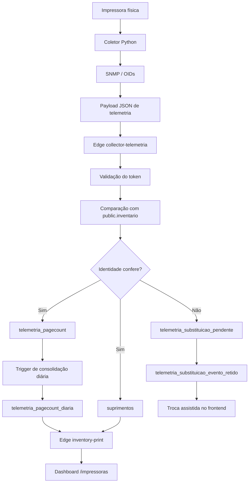
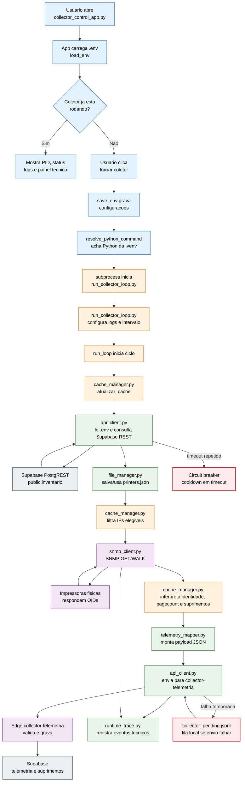
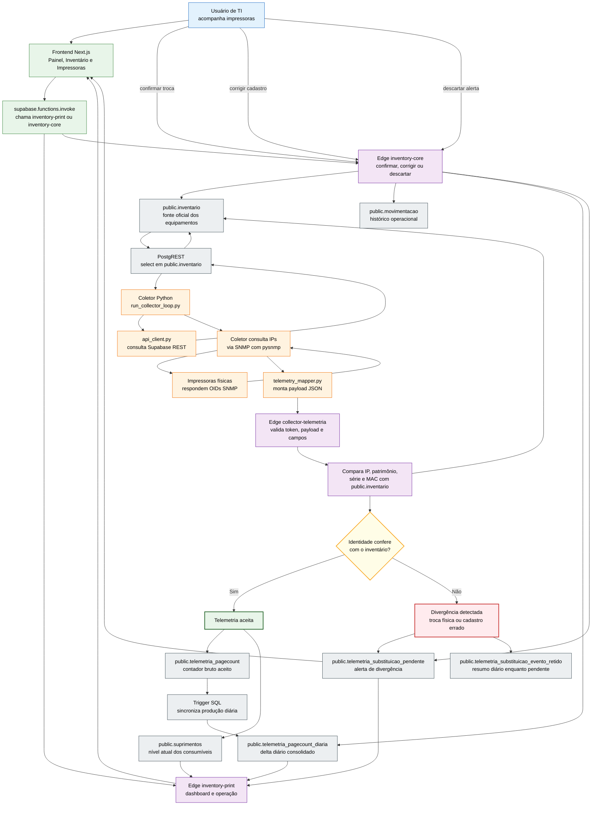
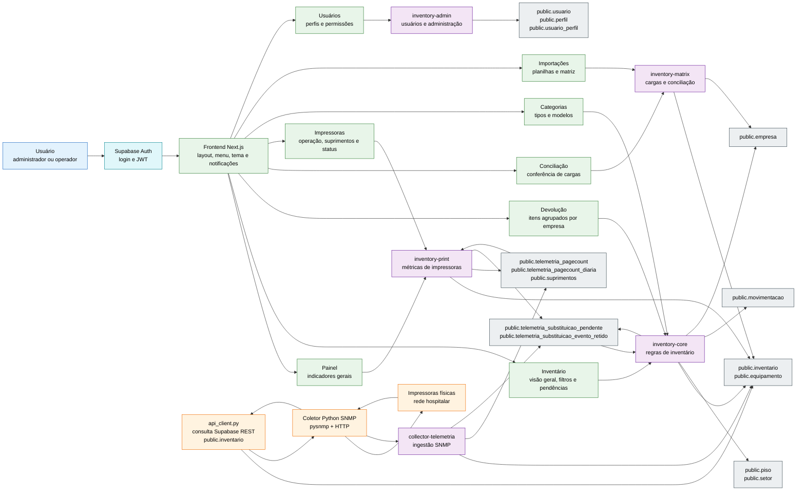

# Inventário Unificado e Telemetria de Impressoras

Sistema de inventário unificado e operação de impressoras para ambiente hospitalar. O projeto integra três partes principais: inventário patrimonial, coleta SNMP das impressoras e análise operacional de impressão, pagecount e suprimentos.

A parte central para apresentação do TCC é o módulo de impressoras e telemetria, porque ele conecta hardware real na rede, coletor Python, Edge Functions, banco PostgreSQL/Supabase, triggers SQL e interface web.

# Fluxo de Impressoras e Telemetria

O foco técnico da apresentação do TCC é o fluxo de impressoras: coleta SNMP, coletor Python, telemetria, pagecount, suprimentos, troca assistida e dashboard operacional.

A fonte oficial das impressoras é `public.inventario`. A telemetria coletada pela rede é gravada nas tabelas atuais de impressoras: `public.telemetria_pagecount`, `public.telemetria_pagecount_diaria`, `public.suprimentos`, `public.telemetria_substituicao_pendente`, `public.telemetria_substituicao_evento_retido` e `public.tarifas_bilhetagem`.

Documento completo de estudo para o TCC:

- [Mapa de Estudo TCC - Impressoras e Telemetria](docs/MAPA_ESTUDO_IMPRESSORAS_TCC.md)



## Objetivo
O sistema foi criado para responder perguntas práticas da operação de TI:

- Onde cada equipamento está?
- Qual impressora está ativa em cada setor?
- Qual impressora está em backup, manutenção ou devolução?
- Quanto foi impresso por dia, por modelo e por setor?
- Quais suprimentos estão críticos?
- Quando uma impressora foi trocada fisicamente?
- Como evitar que uma troca física jogue o contador histórico inteiro da impressora nova no volume diário do setor?

## Visão Geral dos Módulos

### Inventário Web

Local principal:

```text
inventario-unificado-web/
```

Responsável por cadastrar, consultar e movimentar equipamentos. A tela de inventário organiza os itens por piso, setor, localização, tipo, status e relação hierárquica. Também exibe pendências de substituição detectadas pela telemetria das impressoras.

Arquivos principais:

```text
inventario-unificado-web/app/inventario/page.tsx
inventario-unificado-web/app/inventario/devolucao/page.tsx
inventario-unificado-web/app/impressoras/page.tsx
inventario-unificado-web/app/page.tsx
inventario-unificado-web/components/AppShell.tsx
inventario-unificado-web/services/telemetriaDiariaService.ts
```

### Coletor SNMP Python

Local principal:

```text
coletor-snmp/
```

Responsável por descobrir quais impressoras devem ser consultadas, acessar cada IP pela rede usando SNMP, coletar identidade da impressora, contador de páginas e suprimentos, montar o payload JSON e enviar tudo para o Supabase Edge Functions.

Arquivos principais:

```text
coletor-snmp/utils/snmp_client.py
coletor-snmp/utils/telemetry_mapper.py
coletor-snmp/utils/cache_manager.py
coletor-snmp/utils/api_client.py
coletor-snmp/utils/file_manager.py
coletor-snmp/utils/runtime_trace.py
coletor-snmp/scripts/run_collector_loop.py
coletor-snmp/scripts/collector_control_app.py
```

### Edge Functions

Local principal:

```text
inventario-unificado-web/supabase/functions/
```

Responsáveis por aplicar regras de negócio do lado do backend. O frontend chama essas funções para consultar, alterar e resolver dados com validação. O coletor também chama Edge Functions para buscar impressoras e enviar telemetria.

Funções principais:

```text
collector-impressoras
collector-telemetria
inventory-core
inventory-print
inventory-admin
inventory-matrix
```

Resumo rapido do papel de cada uma:

| Edge Function | O que faz no sistema |
| --- | --- |
| `collector-impressoras` | Entrega ao coletor a lista de impressoras oficiais vindas de `public.inventario`. |
| `collector-telemetria` | Recebe payload SNMP do coletor, compara identidade, grava pagecount/suprimentos ou cria pendencia de troca. |
| `inventory-core` | Nucleo do inventario: lista contexto, cria/edita/movimenta itens, resolve pendencias, manutencao e devolucao. |
| `inventory-print` | Monta visao operacional de impressoras, dashboard, suprimentos, status e ranking de impressao. |
| `inventory-admin` | Administra cadastros base: piso, empresa, tipo, setor, equipamento e validacao de perfil ADMIN. |
| `inventory-matrix` | Controla importacao Matrix: inicia carga, insere linhas e finaliza conferencia da carga. |

O passo a passo completo de quem chama, como autentica, quais actions existem, quais tabelas usa e como cada uma executa esta em:

```text
docs/05-api/overview.md
```

### Camadas de API do Sistema

No projeto, a palavra "API" aparece em duas camadas diferentes. As duas recebem requisicoes HTTP, mas elas nao tem o mesmo papel.

#### 1. Supabase Edge Functions

As Edge Functions sao APIs backend serverless executadas no Supabase. Elas ficam em:

```text
inventario-unificado-web/supabase/functions/
```

Funcoes atuais:

```text
collector-impressoras
collector-telemetria
inventory-core
inventory-print
inventory-admin
inventory-matrix
```

Papel delas:

- concentrar regras criticas de negocio;
- validar permissao, token ou sessao antes de alterar dados;
- receber telemetria do coletor Python;
- gravar e consultar dados no PostgreSQL/Supabase;
- reduzir risco de o frontend gravar algo errado direto no banco.

Resumo para apresentar:

```text
Edge Function = API backend principal do Supabase.
```

#### 2. Rotas API do Next.js

As rotas API do Next.js tambem sao APIs HTTP, mas rodam dentro do projeto web. Elas ficam em:

```text
inventario-unificado-web/app/api/
```

Exemplos:

```text
/api/auth/me
/api/inventario
/api/impressoras
/api/telemetria/resumo-diario
```

Papel delas:

- apoiar telas do proprio site;
- encapsular consultas auxiliares;
- integrar services TypeScript usados pelo frontend;
- manter compatibilidade com fluxos internos do Next.js.

Resumo para apresentar:

```text
Rotas app/api = APIs internas do site Next.js.
```

Portanto, as Edge Functions sao APIs, mas nao sao as unicas APIs do projeto. A diferenca principal e que as regras mais sensiveis e operacionais ficam nas Edge Functions, enquanto as rotas `app/api` ajudam o site a organizar chamadas internas.

### Banco Supabase

Arquivo principal de referência:

```text
inventario-unificado-web/supabase/migrations/SQL Sistema.sql
```

Tabelas principais:

```text
public.inventario
public.movimentacao
public.empresa
public.equipamento
public.piso
public.setor
public.usuario
public.perfil
public.usuario_perfil
public.telemetria_pagecount
public.telemetria_pagecount_diaria
public.telemetria_substituicao_pendente
public.telemetria_substituicao_evento_retido
public.suprimentos
```


## Estrutura de Pastas

O projeto esta organizado para separar claramente sistema web, coletor Python e documentacao.

```text
INVENT_COLECTOR/
|- inventario-unificado-web/   Frontend Next.js, services TypeScript, Edge Functions e SQL Supabase
|- coletor-snmp/               Aplicativo Python local que coleta impressoras via SNMP
|- docs/                       Documentacao tecnica, TCC, deploy, banco e troubleshooting
|- .venv/                      Ambiente virtual Python local
|- .vscode/                    Configuracoes locais do editor
`- README.md                   Entrada principal do projeto no GitHub
```

Resumo das pastas principais:

| Pasta | Papel no sistema |
| --- | --- |
| `inventario-unificado-web/app` | Paginas Next.js, rotas internas e CSS global. |
| `inventario-unificado-web/components` | Componentes reutilizaveis de interface. |
| `inventario-unificado-web/services` | Camada TypeScript de acesso a dados e regras auxiliares. |
| `inventario-unificado-web/lib` | Helpers compartilhados, Supabase, seguranca e validacoes. |
| `inventario-unificado-web/supabase/functions` | Edge Functions que aplicam regras de negocio no backend. |
| `inventario-unificado-web/supabase/migrations` | SQL do banco, tabelas, triggers e funcoes. |
| `coletor-snmp/scripts` | Scripts executaveis do coletor, incluindo app visual e loop. |
| `coletor-snmp/utils` | Modulos Python de SNMP, cache, API, mapper e arquivos locais. |
| `coletor-snmp/data` | Cache local, fila pendente e dados de apoio do coletor. |
| `coletor-snmp/logs` | Logs de execucao e rastros tecnicos do coletor. |
| `docs` | Documentacao de arquitetura, banco, coletor, TCC e operacao. |

Documentacao detalhada da estrutura e CSS:

```text
docs/21-estrutura-pastas-css.md
docs/22-mapa-completo-arquivos.md
```

O arquivo `docs/22-mapa-completo-arquivos.md` e o catalogo mais detalhado: ele lista cada arquivo versionado no Git, agrupado por pasta, e explica o papel de cada um no sistema.

## Organizacao de CSS

O CSS principal fica em:

```text
inventario-unificado-web/app/globals.css
```

A estrategia recomendada nao e jogar tudo sem criterio no global. O ideal e:

- `globals.css` para tokens de tema, layout, componentes reutilizaveis e classes por pagina bem separadas por comentarios;
- classes `ui-*` para componentes globais;
- classes `inventory-*`, `printers-*` e `dashboard-*` para estilos especificos de pagina;
- CSS inline apenas quando o valor e dinamico, como largura de barra percentual ou variavel calculada por dado.

Exemplo:

```tsx
<span className="ui-supply-fill" style={{ width: `${percentual}%` }} />
```

Nesse caso, o inline faz sentido porque `percentual` vem do dado da impressora. Ja `marginBottom`, `padding`, cor fixa e grid repetido devem virar classe CSS.

Observacao da sanitizacao: a antiga tela `app/operacional/page.tsx` foi removida. O acompanhamento operacional atual fica na tela `/impressoras`, que usa dados consolidados pela Edge Function `inventory-print`.

## Como a Coleta de Impressoras Funciona

A fonte oficial das impressoras é `public.inventario`. Não existe tabela separada de impressoras no fluxo atual.

O coletor Python nao sai inventando IP. Em producao, ele consulta diretamente o Supabase/PostgREST usando `COLLECTOR_PRINTERS_SOURCE=supabase` e a tabela `public.inventario`. A lista oficial retorna somente itens ativos do inventario que possuem IP preenchido e que podem ser consultados por SNMP.

Critérios principais da lista do coletor:

```text
ie_situacao = A
nr_ip preenchido
```

Na prática:

- `ie_situacao = A` significa que o item está ativo no inventário;
- `nr_ip preenchido` significa que existe endereço de rede para consultar via SNMP;
- itens sem IP não entram no ciclo de coleta;
- itens em backup sem IP continuam existindo no inventário, mas não são varridos pelo coletor.

## O Que é SNMP no Sistema

SNMP significa Simple Network Management Protocol. É um protocolo usado para consultar informações de equipamentos de rede, como impressoras, switches e nobreaks.

No projeto, o coletor Python usa SNMP para perguntar dados diretamente para cada impressora. A impressora responde valores identificados por OIDs, que são endereços padronizados dentro da árvore SNMP do equipamento.

Exemplos de dados consultados:

- número de série;
- endereço MAC;
- hostname;
- contador total de páginas;
- percentual de toner;
- unidade de imagem;
- kit de manutenção;
- status online/offline.

## Bibliotecas Principais

### Python

```text
pysnmp
urllib.request
json
logging
concurrent.futures
tkinter
pystray
Pillow
```

`pysnmp` executa as consultas SNMP. `urllib.request` envia requisições HTTP para as Edge Functions. `json` monta e lê payloads. `logging` registra o que aconteceu em cada ciclo. `concurrent.futures` permite consultar várias impressoras em paralelo sem travar o coletor em uma única máquina lenta. `tkinter`, `pystray` e `Pillow` apoiam a interface local e o ícone de bandeja.

### Frontend

```text
next
react
@supabase/supabase-js
lucide-react
@flaticon/flaticon-uicons
xlsx
jspdf
jspdf-autotable
zod
```

Next.js e React constroem as telas. Supabase JS chama autenticação e Edge Functions. As bibliotecas de exportação geram planilhas e PDFs. As bibliotecas de ícones melhoram a leitura visual. `zod` ajuda a validar dados quando necessário.


## Fluxograma - Aplicativo Python do Coletor

Este fluxo mostra os arquivos Python locais do coletor e como eles trabalham juntos. Ele complementa o fluxograma geral de impressoras, focando no aplicativo que inicia/para o coletor e no loop que executa a coleta.



Resumo curto do fluxo Python:

```text
collector_control_app.py -> run_collector_loop.py -> cache_manager.py -> snmp_client.py -> telemetry_mapper.py -> api_client.py -> Supabase
```

## Fluxograma - Impressoras e Telemetria

Este fluxograma mostra somente a parte de impressoras. A fonte oficial das impressoras coletadas é `public.inventario`. A interface web não grava regra crítica direto no banco; ela chama Edge Functions, e as Edge Functions aplicam validações, permissões e regras de negócio antes de escrever no Supabase.



## Fluxograma - Inventário Completo com Impressoras

Este fluxograma mostra o sistema inteiro: autenticação, telas, Edge Functions, tabelas principais, coletor SNMP e impressoras físicas.



## Proteção Contra Explosão de Pagecount

Impressoras possuem contador físico histórico. Uma impressora reserva pode já ter centenas de milhares de páginas no contador interno. Se o sistema somasse esse total no dia da troca, o dashboard mostraria um volume falso.

A regra correta é trabalhar com delta, ou seja, diferença entre leituras consistentes:

```text
contador no início do período = 200
contador depois = 250
páginas produzidas = 50
```

O sistema não soma `200 + 250`. Ele calcula a diferença.

Quando existe divergência de identidade, a telemetria não é aplicada imediatamente no item errado. Enquanto a pendência está aberta, a produção fica resumida por dia em `telemetria_substituicao_evento_retido`. Assim o banco não recebe uma linha por ciclo sem necessidade e o plano gratuito do Supabase fica mais protegido.

## Como Rodar Localmente

Frontend:

```powershell
cd inventario-unificado-web
npm run dev
```

Coletor:

```powershell
python ./coletor-snmp/scripts/run_collector_loop.py
```

Deploy das Edge Functions alteradas:

```powershell
cd inventario-unificado-web
npx supabase functions deploy collector-impressoras --no-verify-jwt --project-ref tcxaktsleilbdgxcstqo
npx supabase functions deploy collector-telemetria --no-verify-jwt --project-ref tcxaktsleilbdgxcstqo
npx supabase functions deploy inventory-core --project-ref tcxaktsleilbdgxcstqo
npx supabase functions deploy inventory-print --project-ref tcxaktsleilbdgxcstqo
```

Deploy do frontend:

```powershell
cd inventario-unificado-web
npx vercel --prod
```
