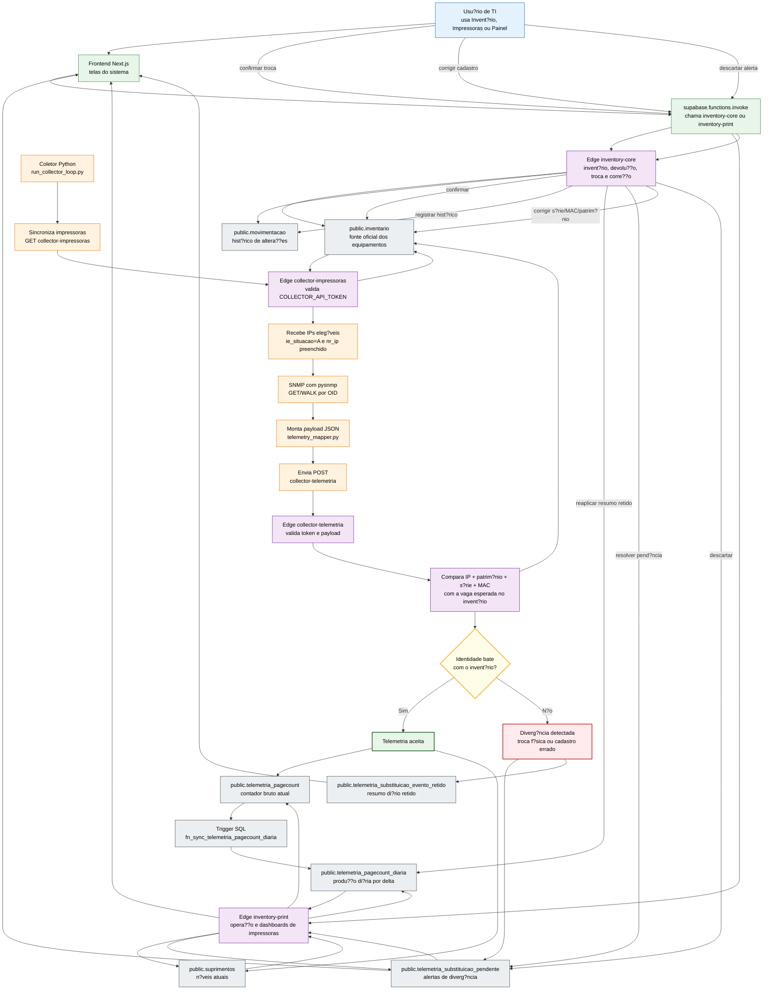
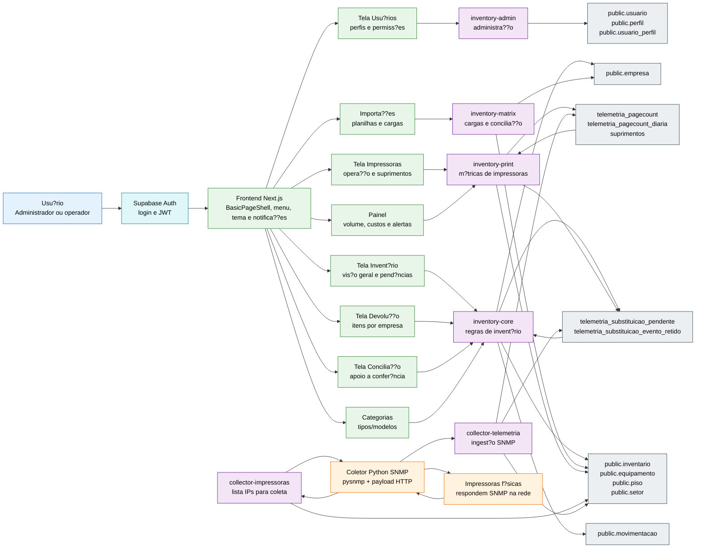

# Inventário Unificado e Telemetria de Impressoras

Sistema de inventário unificado e operação de impressoras para ambiente hospitalar. O projeto junta três mundos que antes ficavam separados: inventário patrimonial, coleta SNMP das impressoras e análise operacional de impressão/suprimentos.

## Objetivo

O objetivo é responder perguntas práticas da operação de TI:

- Onde cada equipamento está?
- Qual impressora está ativa em cada setor?
- Qual impressora está em backup, manutenção ou devolução?
- Quanto foi impresso por dia, por modelo e por setor?
- Quais suprimentos estão críticos?
- Quando uma impressora foi trocada fisicamente?
- Como evitar que uma troca física jogue o contador histórico inteiro no volume diário?

A parte principal para apresentação do TCC é o módulo de impressoras/telemetria, porque ele integra hardware real, rede, coletor Python, Edge Functions, banco Supabase, triggers SQL e interface web.

## Módulos do Projeto

### 1. Inventário Web

Local principal:

```text
inventario-unificado-web/
```

Responsável por:

- cadastrar e consultar equipamentos;
- organizar itens por piso, setor e localização;
- controlar status como ativo, manutenção, backup e devolução;
- exibir pendências de substituição detectadas pela telemetria;
- permitir confirmação, descarte ou correção de dados quando a telemetria aponta divergência.

Arquivos importantes:

```text
inventario-unificado-web/app/inventario/page.tsx
inventario-unificado-web/app/inventario/devolucao/page.tsx
inventario-unificado-web/services/telemetriaDiariaService.ts
```

### 2. Coletor SNMP Python

Local principal:

```text
coletor-snmp/
```

Responsável por:

- buscar a lista de impressoras no inventário;
- consultar impressoras pela rede via SNMP;
- coletar série, MAC, contador de páginas e suprimentos;
- montar payload JSON;
- enviar os eventos para a Edge Function `collector-telemetria`;
- registrar logs e pendências locais quando necessário.

Arquivos importantes:

```text
coletor-snmp/utils/snmp_client.py
coletor-snmp/utils/telemetry_mapper.py
coletor-snmp/utils/cache_manager.py
coletor-snmp/utils/printer_sync_service.py
coletor-snmp/utils/supabase_client.py
coletor-snmp/scripts/run_collector_loop.py
```

### 3. Supabase Edge Functions

Local principal:

```text
inventario-unificado-web/supabase/functions/
```

Responsáveis por receber payloads do coletor, validar token, comparar identidade detectada contra inventário, gravar pagecount/suprimentos, criar pendências e expor dados para o frontend.

Funções principais:

```text
collector-telemetria
collector-impressoras
inventory-core
inventory-print
```

### 4. Banco Supabase

Arquivo principal de referência:

```text
inventario-unificado-web/supabase/migrations/SQL Sistema.sql
```

Tabelas importantes:

```text
public.inventario
public.movimentacao
public.empresa
public.telemetria_pagecount
public.telemetria_pagecount_diaria
public.telemetria_substituicao_pendente
public.telemetria_substituicao_evento_retido
public.suprimentos
```

## Fluxo Geral da Telemetria

1. O inventário guarda quais impressoras existem e quais IPs devem ser coletados.
2. O coletor Python consulta a lista de impressoras elegíveis.
3. Para cada IP, o coletor faz consultas SNMP.
4. A impressora responde dados reais: série, MAC, contador e suprimentos.
5. O coletor monta um payload JSON.
6. A Edge `collector-telemetria` recebe o payload.
7. A Edge procura no `public.inventario` qual item deveria estar naquele IP.
8. Se os identificadores batem, grava pagecount e suprimentos.
9. Se algum identificador forte diverge, cria pendência em `telemetria_substituicao_pendente`.
10. Enquanto a pendência está aberta, o sistema não grava pagecount no item errado.
11. A produção fica retida por dia em `telemetria_substituicao_evento_retido`.
12. Quando o usuário confirma, corrige ou descarta, `inventory-core` resolve a pendência.

## Fluxograma Corrigido - Impressoras e Telemetria

Este fluxo corrige uma confus?o comum: no sistema atual, a fonte oficial das impressoras ? `public.inventario`. A Edge `collector-impressoras` ainda possui fallback para uma tabela chamada `impressoras` caso ela exista em algum ambiente antigo, mas no banco atual a coleta vem do invent?rio.

Outro ponto importante: o frontend n?o grava regra cr?tica direto no banco. As telas chamam Edge Functions, e as Edge Functions aplicam valida??es, permiss?es e regras de neg?cio antes de escrever no Supabase.



## Fluxograma Corrigido - Sistema Inteiro



## Proteção Contra Explosão de Pagecount

Impressoras possuem contador físico histórico. Uma impressora reserva pode já ter 500.000 páginas no contador interno. Se o sistema somasse esse total no dia da troca, o dashboard mostraria um volume falso.

Regra usada:

- contador bruto fica em `telemetria_pagecount`;
- produção diária fica em `telemetria_pagecount_diaria`;
- primeira leitura suspeita não é gravada diretamente no item errado;
- pendência de substituição é aberta;
- produção enquanto a pendência está aberta é consolidada por dia, não por ciclo;
- se for troca real, a produção retida é aplicada ao equipamento correto;
- se for erro cadastral, o usuário corrige série/MAC/patrimônio.

Exemplo correto:

```text
contador no início do dia = 200
contador depois = 250
páginas do dia = 50
```

O sistema não soma `200 + 250`. Ele calcula a diferença.

## Bibliotecas Principais

### Python

```text
pysnmp
urllib.request
json
logging
concurrent.futures
tkinter
pystray
Pillow
```

`pysnmp` faz a comunicação SNMP com as impressoras. `urllib.request` envia os payloads para as Edge Functions. As outras bibliotecas ajudam com JSON, logs, paralelismo, interface local e ícone de bandeja.

### Frontend

```text
next
react
@supabase/supabase-js
lucide-react
@flaticon/flaticon-uicons
xlsx
jspdf
jspdf-autotable
zod
```

Next.js e React constroem a interface. Supabase JS integra com o backend. As bibliotecas de exportação geram planilhas e PDFs. As bibliotecas de ícone melhoram a usabilidade visual.

## Comandos Úteis

Rodar frontend local:

```powershell
cd C:\Users\7003233\Desktop\INVENT_COLECTOR\inventario-unificado-web
npm run dev
```

Rodar coletor local:

```powershell
cd C:\Users\7003233\Desktop\INVENT_COLECTOR
python .\coletor-snmp\scripts\run_collector_loop.py
```

Deploy Vercel:

```powershell
cd C:\Users\7003233\Desktop\INVENT_COLECTOR\inventario-unificado-web
npx vercel --prod
```

Deploy Supabase Functions:

```powershell
cd C:\Users\7003233\Desktop\INVENT_COLECTOR\inventario-unificado-web
npx supabase functions deploy inventory-core --project-ref tcxaktsleilbdgxcstqo
npx supabase functions deploy inventory-print --project-ref tcxaktsleilbdgxcstqo
npx supabase functions deploy collector-impressoras --no-verify-jwt --project-ref tcxaktsleilbdgxcstqo
npx supabase functions deploy collector-telemetria --no-verify-jwt --project-ref tcxaktsleilbdgxcstqo
```

## Documentação Principal

- [Guia Integrado TCC](docs/20-guia-integrado-tcc-impressao-telemetria.md)
- [Arquitetura](docs/02-architecture.md)
- [Banco de Dados](docs/04-database.md)
- [API Collector Telemetria](docs/05-api/collector-telemetria.md)
- [API Inventory Print](docs/05-api/inventory-print.md)
- [API Inventory Core](docs/05-api/inventory-core.md)
- [Pagecount Diário](docs/16-telemetria-pagecount-modelo-diario.md)
- [Bilhetagem e Tarifas](docs/17-bilhetagem-tarifas-supabase.md)

## Resumo Para Apresentação

O sistema usa o inventário como fonte oficial, coleta dados reais das impressoras via SNMP, compara identidade física com o cadastro e registra produção diária sem misturar contador histórico com volume do dia. Quando encontra divergência, abre uma troca assistida para proteger o histórico e evitar números falsos no dashboard.
