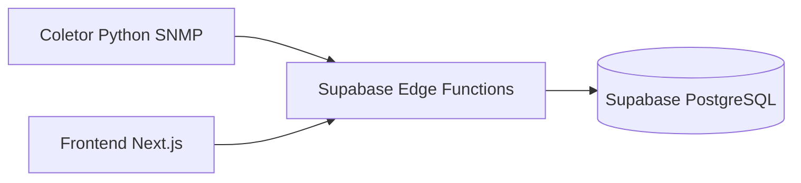

# 02 - Architecture
> **Leitura guiada para estudo:** este documento foi organizado para explicar o papel do módulo, o fluxo prático que ele executa e onde conferir o comportamento no código. Para estudar, leia primeiro o objetivo, depois acompanhe os arquivos/comandos citados e compare a entrada, o processamento e a saída descritos.

## Visao de alto nivel

Arquitetura edge-first:

- Frontend no Vercel (Next.js).
- Regras de negocio no Supabase Edge Functions.
- Persistencia no PostgreSQL (Supabase).
- Coletor SNMP em Python para telemetria.

## Diagrama

## Camadas

1. Coleta
- Python + pysnmp.
- Execucao em loop com envio autenticado para endpoint de coleta.

2. Aplicacao
- Next.js + React + TypeScript.
- Telas de inventario, Matrix, conciliacao e operacao de impressoras.

3. Backend de dados
- Edge Functions: inventory-admin, inventory-core, inventory-matrix, inventory-print.
- Banco relacional com integridade referencial.

4. Infra
- Vercel para frontend.
- Supabase para backend e dados.

## Migracao de legado para Edge Functions

Status atual:

- Operacoes principais ja estao em Edge Functions.
- APIs Next de coletor ainda existem por compatibilidade.

Plano de migracao:

1. Catalogar rotas legadas ainda ativas e consumidores.
2. Replicar contratos restantes em Edge Function dedicada.
3. Habilitar periodo de dupla escrita/leitura onde necessario.
4. Remover dependencia das rotas Next apos validacao.
5. Encerrar rotas legadas e atualizar monitoramento.

Criterios de pronto:

- 100% das operacoes de dados atendidas por Edge.
- Rotas legadas sem trafego relevante por 2 ciclos de release.
- Alertas e logs ajustados para novo fluxo.

## ADRs relacionadas

- [ADR 001 - Edge First](ADR/001-edge-first.md)
- [ADR 002 - Matrix Separada](ADR/002-matrix-separada.md)

## Atualizacao 2026-05-04

- Camada de telemetria foi simplificada para reduzir volume de dados.
- Padrao atual:
  - tabela de estado (`telemetria_pagecount`)
  - tabela de historico diario (`telemetria_pagecount_diaria`)
  - trigger no banco para consolidacao automatica por dia.
- Referencia: [16-telemetria-pagecount-modelo-diario](16-telemetria-pagecount-modelo-diario.md).
