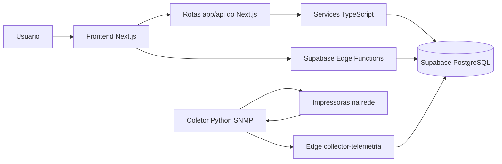

# 02 - Arquitetura

Este documento explica a arquitetura do sistema em linguagem de estudo. A ideia e separar claramente frontend, APIs, Edge Functions, banco e coletor Python.

## Visao de Alto Nivel

O sistema segue uma arquitetura web com backend serverless e coletor local:

- **Frontend**: Next.js publicado na Vercel.
- **APIs internas do site**: rotas `app/api` do Next.js.
- **Backend principal**: Supabase Edge Functions.
- **Banco de dados**: PostgreSQL gerenciado pelo Supabase.
- **Coletor**: aplicacao Python local que consulta impressoras via SNMP.

Fluxo resumido:

```text
Usuario -> Frontend Next.js -> API/Edge Function -> Supabase PostgreSQL
Coletor Python -> SNMP nas impressoras -> collector-telemetria -> Supabase PostgreSQL
```

## Diagrama Geral



## Camada 1 - Frontend Next.js

Local principal:

```text
inventario-unificado-web/app/
inventario-unificado-web/components/
```

Responsabilidades:

- renderizar telas;
- controlar formularios, filtros, tabelas e navegacao;
- chamar APIs internas ou Edge Functions;
- mostrar mensagens de erro, loading e sucesso;
- nunca concentrar sozinho regra critica de negocio.

Exemplos de telas:

```text
app/page.tsx
app/inventario/page.tsx
app/impressoras/page.tsx
app/inventario/devolucao/page.tsx
app/usuarios/page.tsx
```

## Camada 2 - Rotas API do Next.js

Local:

```text
inventario-unificado-web/app/api/
```

Essas rotas tambem sao APIs HTTP. Elas rodam dentro do projeto Next.js e servem principalmente como APIs internas do site.

Exemplos:

```text
app/api/auth/me/route.ts
app/api/inventario/route.ts
app/api/impressoras/route.ts
app/api/telemetria/resumo-diario/route.ts
```

Responsabilidades:

- apoiar chamadas do frontend;
- centralizar pequenas consultas auxiliares;
- chamar services TypeScript;
- retornar JSON para as telas;
- manter compatibilidade com fluxos internos do site.

Resumo:

```text
Rotas app/api = APIs internas do projeto Next.js.
```

## Camada 3 - Supabase Edge Functions

Local:

```text
inventario-unificado-web/supabase/functions/
```

As Edge Functions sao APIs backend serverless publicadas no Supabase. Elas sao a camada mais importante para regras sensiveis.

Funcoes atuais:

```text
collector-impressoras
collector-telemetria
inventory-core
inventory-print
inventory-admin
inventory-matrix
```

Responsabilidades:

- validar token, JWT ou permissao;
- aplicar regras de negocio;
- receber payloads do coletor Python;
- resolver troca/correcao de impressoras;
- consultar dashboard de impressoras;
- gravar dados no banco de forma controlada;
- proteger operacoes que nao devem depender apenas do frontend.

Resumo:

```text
Edge Function = API backend principal do Supabase.
```

## Diferenca Entre Edge Functions e Rotas app/api

As duas camadas sao APIs, mas nao tem o mesmo papel.

| Camada | Onde fica | Para que serve |
| --- | --- | --- |
| Edge Functions | `supabase/functions/` | Backend serverless principal, regras criticas, coletor, inventario e telemetria |
| Rotas Next.js | `app/api/` | APIs internas do site, apoio ao frontend e chamadas auxiliares |

Frase simples para explicar no TCC:

```text
O sistema tem APIs em duas camadas. As Edge Functions sao o backend serverless principal. As rotas app/api sao APIs internas do Next.js usadas para apoiar o site.
```

## Camada 4 - Services TypeScript

Local:

```text
inventario-unificado-web/services/
```

Os services sao arquivos TypeScript que concentram consultas e transformacoes de dados usadas por rotas, paginas e componentes.

Exemplos:

```text
inventarioService.ts
impressorasService.ts
telemetriaDiariaService.ts
statusSuprimentosImpressorasService.ts
visaoGeralImpressorasService.ts
```

Responsabilidades:

- buscar dados no Supabase;
- montar objetos para as telas;
- evitar regra duplicada no JSX;
- deixar APIs e paginas menores.

## Camada 5 - Banco Supabase/PostgreSQL

Arquivo principal:

```text
inventario-unificado-web/supabase/migrations/SQL Sistema.sql
```

Tabelas principais:

```text
public.inventario
public.movimentacao
public.usuario
public.perfil
public.usuario_perfil
public.telemetria_pagecount
public.telemetria_pagecount_diaria
public.telemetria_substituicao_pendente
public.telemetria_substituicao_evento_retido
public.suprimentos
```

Responsabilidades:

- guardar o inventario oficial;
- manter historico de movimentacao;
- guardar pagecount e suprimentos;
- consolidar producao diaria por trigger;
- registrar pendencias de substituicao assistida.

## Camada 6 - Coletor Python SNMP

Local:

```text
coletor-snmp/
```

O coletor e uma aplicacao local separada do site. Ele busca a lista oficial de impressoras no Supabase, consulta cada IP via SNMP e envia a telemetria para o backend.

Arquivos principais:

```text
scripts/collector_control_app.py
scripts/run_collector_loop.py
utils/api_client.py
utils/cache_manager.py
utils/snmp_client.py
utils/telemetry_mapper.py
utils/runtime_trace.py
```

Responsabilidades:

- sincronizar impressoras ativas do inventario;
- consultar impressoras reais via SNMP;
- coletar serie, MAC, contador e suprimentos;
- montar payload JSON;
- enviar para `collector-telemetria`;
- reter/replay de payloads quando houver falha temporaria.

## Decisao Arquitetural

O projeto segue uma ideia de **Edge First**:

- regras importantes ficam em Edge Functions;
- o frontend fica focado em interface;
- o banco mantem integridade e triggers;
- o coletor fica separado, porque precisa acessar a rede local das impressoras.

Referencias:

- [ADR 001 - Edge First](ADR/001-edge-first.md)
- [ADR 002 - Matrix Separada](ADR/002-matrix-separada.md)
- [05 - API Overview](05-api/overview.md)
- [06 - Coletor Python](06-collector.md)
