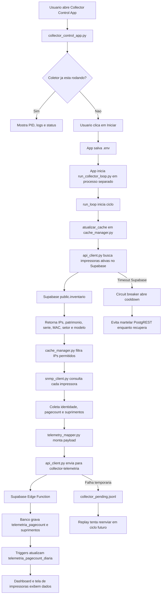

# 06 - Coletor Python SNMP

Este documento explica, em linguagem de estudo, como funciona o coletor Python das impressoras: aplicativo local, loop de coleta, arquivos de apoio, SNMP, sincronizacao com Supabase, envio para Edge Functions e variaveis do `.env`.

A ideia central e simples: o site guarda o cadastro oficial das impressoras no Supabase, o coletor Python busca quais impressoras estao ativas, consulta cada IP via SNMP e envia a telemetria para o backend.

## 1. Objetivo do Coletor

O coletor existe para automatizar a leitura das impressoras da rede.

Ele faz quatro trabalhos principais:

- buscar no Supabase a lista de impressoras ativas do inventario;
- consultar cada impressora na rede usando SNMP;
- transformar a resposta tecnica da impressora em um payload padronizado;
- enviar esse payload para as Edge Functions, que gravam pagecount, suprimentos e alertas.

No TCC, ele pode ser explicado como o componente de integracao entre o mundo fisico das impressoras e o banco de dados do sistema.

## 2. O Que e SNMP

SNMP significa Simple Network Management Protocol. E um protocolo usado para consultar informacoes de equipamentos de rede, como impressoras, switches e roteadores.

No caso das impressoras, o SNMP permite buscar dados como:

- contador total de paginas;
- numero de serie;
- endereco MAC;
- hostname;
- modelo/fabricante;
- nivel de toner;
- unidade de imagem;
- kit de manutencao;
- status online/offline.

O coletor nao entra na impressora como usuario. Ele pergunta valores tecnicos por OID.

OID e um endereco numerico de informacao SNMP. Exemplo conceitual:

```text
1.3.6.1.2.1.43.10.2.1.4.1.1
```

Esse tipo de codigo aponta para um contador ou propriedade da impressora. O arquivo `snmp_client.py` e quem executa essas consultas.

## 3. Fonte Oficial das Impressoras

No sistema atual, nao existe tabela separada `impressoras` como fonte principal.

A fonte oficial e:

```text
public.inventario
```

O coletor deve buscar itens do inventario que sejam impressoras ativas e tenham IP preenchido.

Em producao, para o seu ambiente, a configuracao desejada e:

```env
COLLECTOR_PRINTERS_SOURCE=supabase
COLLECTOR_SUPABASE_PRINTERS_TABLE=inventario
```

Isso significa que o coletor local consulta diretamente o Supabase REST/PostgREST, usando a URL e a chave configuradas no `.env`.

## 4. Por Que o Coletor Pode Mostrar Menos Impressoras

O inventario geral pode mostrar todas as impressoras cadastradas, incluindo backup, manutencao ou itens sem IP.

O coletor so deve varrer impressoras que podem responder na rede.

Regra pratica:

- impressora sem IP nao entra na coleta SNMP;
- impressora inativa nao entra na coleta;
- backup sem uso normalmente nao entra na coleta;
- impressora ativa com IP entra na coleta.

Exemplo real:

```text
Inventario: 116 impressoras cadastradas
Backup/sem coleta: 1
Coletor: 115 impressoras elegiveis
```

## 5. Fluxograma do Aplicativo Python



## 6. Fluxo de Um Ciclo de Coleta

Um ciclo e uma rodada completa do coletor.

Passo a passo:

1. `run_collector_loop.py` acorda pelo intervalo configurado.
2. Ele chama `atualizar_cache()` em `cache_manager.py`.
3. `cache_manager.py` pede a lista atual de impressoras para `api_client.py`.
4. `api_client.py` consulta o Supabase, tabela `public.inventario`.
5. A lista volta com impressoras ativas e IP preenchido.
6. O coletor aplica filtros de rede, como `172.` e `10.6.`.
7. Para cada IP, `snmp_client.py` faz consultas SNMP.
8. `cache_manager.py` interpreta pagecount e suprimentos.
9. `telemetry_mapper.py` monta o payload final.
10. `api_client.py` envia para a Edge `collector-telemetria`.
11. A Edge compara identidade, grava dados ou abre pendencia.
12. O banco consolida o dia por trigger.

## 7. Arquivos Python do Coletor

### 7.1 `scripts/collector_control_app.py`

Aplicativo visual em Python/Tkinter para operar o coletor sem depender do terminal.

Ele faz:

- abre uma janela local;
- permite editar/salvar variaveis do `.env`;
- inicia o coletor em segundo plano;
- para o processo pelo PID;
- mostra logs recentes;
- mostra eventos tecnicos de backend;
- minimiza para bandeja quando `pystray` esta disponivel;
- impede abrir duas instancias ao mesmo tempo.

Este arquivo nao coleta SNMP diretamente. Ele controla o processo que coleta.

### 7.2 `scripts/run_collector_loop.py`

Script que fica rodando o coletor em ciclos.

Ele faz:

- configura logs;
- le argumentos de linha de comando;
- define intervalo entre ciclos;
- registra sinais de parada segura;
- chama `atualizar_cache()` a cada ciclo;
- continua rodando mesmo se um ciclo falhar;
- permite modo `--once` para testar uma coleta unica;
- permite `--check-connection` para validar a fonte remota de impressoras.

### 7.3 `utils/cache_manager.py`

Arquivo central da coleta.

Ele faz:

- decide quais impressoras serao coletadas;
- busca identidade real da impressora por SNMP;
- detecta familia/modelo para escolher OIDs corretos;
- coleta contador de paginas;
- coleta suprimentos;
- monta snapshot por impressora;
- chama o mapper para gerar payload;
- envia telemetria;
- salva cache local.

Se fosse comparar com uma fabrica, este arquivo e a linha de producao.

### 7.4 `utils/snmp_client.py`

Camada tecnica de SNMP.

Ele faz:

- executa `GET` para buscar um valor unico;
- executa `WALK` para varrer uma arvore de OIDs;
- controla timeout e retry;
- transforma resposta bruta do `pysnmp` em texto/numero utilizavel;
- devolve erro claro quando a impressora nao responde.

### 7.5 `utils/telemetry_mapper.py`

Camada de traducao do payload.

Ele faz:

- pega dados brutos do coletor;
- normaliza texto, modelo, fabricante e suprimentos;
- gera `ingestao_id` unico;
- monta o JSON esperado pela Edge Function;
- padroniza nomes em portugues;
- evita enviar valores soltos ou inconsistentes.

### 7.6 `utils/api_client.py`

Camada de comunicacao HTTP.

Ele faz:

- le configuracoes do `.env`;
- consulta Supabase para lista de impressoras;
- envia telemetria para a Edge;
- aplica timeout, retry e backoff;
- grava payload pendente em arquivo local se o envio falhar;
- reenvia pendencias depois;
- abre circuit breaker quando o Supabase esta com timeout.

### 7.7 `utils/file_manager.py`

Camada de arquivos locais.

Ele faz:

- carrega e salva `printers.json`;
- carrega e salva configuracoes locais;
- carrega chamados locais;
- salva historico opcional;
- centraliza acesso a arquivos para nao espalhar leitura/escrita pelo codigo.

### 7.8 `utils/runtime_trace.py`

Arquivo de auditoria tecnica.

Ele faz:

- grava eventos JSONL;
- sanitiza payloads grandes;
- registra chamadas SNMP e HTTP;
- ajuda a explicar o que o coletor tentou fazer em uma falha.

### 7.9 `scripts/test_collector_push.py`

Script de teste manual.

Ele faz:

- pega uma impressora do cache;
- monta payload de teste;
- pode fazer dry-run sem enviar;
- pode forcar leitura real;
- ajuda a validar se token, payload e Edge estao funcionando.

## 8. Bibliotecas Python Usadas

### `pysnmp`

Biblioteca usada para consultar SNMP.

O coletor usa `pysnmp` para falar com as impressoras na rede. Ele monta requisicoes SNMP v2c usando comunidade, IP, OID, timeout e retry.

### `requests`

Biblioteca usada para HTTP.

Ela envia JSON para as Edge Functions e consulta REST do Supabase quando `COLLECTOR_PRINTERS_SOURCE=supabase`.

### `tkinter`

Biblioteca padrao do Python para interface grafica.

Ela cria a janela do `collector_control_app.py`.

### `pystray` e `Pillow`

Usadas opcionalmente para minimizar o aplicativo para a bandeja do Windows.

Se nao estiverem instaladas, o app ainda funciona, mas pode apenas minimizar a janela normalmente.

### `json`, `os`, `pathlib`, `subprocess`, `logging`, `threading`, `signal`

Bibliotecas padrao usadas para arquivos, ambiente, processos, logs, threads e parada segura.

## 9. Documentacao do `.env`

O `.env` e o arquivo que controla como o coletor se conecta, qual intervalo usa e como se comporta em falhas.

Configuracao recomendada para buscar direto no Supabase:

```env
COLLECTOR_API_BASE_URL=https://inventario-unificado-web.vercel.app
COLLECTOR_API_TOKEN=token_do_coletor
COLLECTOR_ID=collector-hgg-01
COLLECTOR_LOOP_INTERVAL=300

COLLECTOR_SYNC_PRINTERS_FROM_API=true
COLLECTOR_PRINTERS_SOURCE=supabase
COLLECTOR_REQUIRE_REMOTE_PRINTERS=false
COLLECTOR_DEFAULT_SNMP_COMMUNITY=public

COLLECTOR_SUPABASE_URL=https://tcxaktsleilbdgxcstqo.supabase.co
COLLECTOR_SUPABASE_KEY=service_role_ou_chave_configurada
COLLECTOR_SUPABASE_PRINTERS_TABLE=inventario

COLLECTOR_IP_FILTERS=172.,10.6.
COLLECTOR_MAX_WORKERS=4

COLLECTOR_API_TIMEOUT=8
COLLECTOR_API_RETRIES=3
COLLECTOR_API_RETRY_BACKOFF=2

COLLECTOR_REPLAY_PENDING=true
COLLECTOR_REPLAY_MAX_PER_CYCLE=20

COLLECTOR_SYNC_TIMEOUT=20
COLLECTOR_SYNC_RETRIES=2
COLLECTOR_SYNC_RETRY_BACKOFF=2
COLLECTOR_SYNC_FAILURE_COOLDOWN=900
COLLECTOR_ALLOW_API_FALLBACK=false
COLLECTOR_SAVE_HISTORY=false
```

### `COLLECTOR_API_BASE_URL`

URL base do site publicado. O coletor usa essa base para montar endpoints quando precisa enviar para APIs do projeto.

### `COLLECTOR_API_TOKEN`

Token secreto do coletor. Ele autentica o envio para as Edge Functions. Nunca deve ir para README publico com valor real.

### `COLLECTOR_ID`

Nome logico do coletor. Ajuda a saber qual maquina enviou a telemetria.

### `COLLECTOR_LOOP_INTERVAL`

Intervalo entre ciclos, em segundos. `300` significa cinco minutos.

### `COLLECTOR_SYNC_PRINTERS_FROM_API`

Quando `true`, o coletor atualiza a lista de impressoras pelo backend/Supabase antes de coletar.

### `COLLECTOR_PRINTERS_SOURCE`

Define de onde vem a lista de impressoras.

Para seu ambiente:

```env
COLLECTOR_PRINTERS_SOURCE=supabase
```

Isso faz o coletor consultar diretamente o Supabase REST/PostgREST.

### `COLLECTOR_REQUIRE_REMOTE_PRINTERS`

Define se a lista remota e obrigatoria.

Recomendacao operacional:

```env
COLLECTOR_REQUIRE_REMOTE_PRINTERS=false
```

Isso nao desativa a busca no Supabase. Ele ainda tenta buscar direto no Supabase. A diferenca e que, se o Supabase estiver com timeout, o coletor nao derruba o ciclo inteiro nem fica pressionando o projeto sem parar. Ele pode manter o ultimo `printers.json` valido.

Se estiver `true`, qualquer timeout no Supabase aborta o ciclo.

### `COLLECTOR_DEFAULT_SNMP_COMMUNITY`

Comunidade SNMP padrao. Normalmente e `public`.

### `COLLECTOR_SUPABASE_URL`

URL do projeto Supabase.

### `COLLECTOR_SUPABASE_KEY`

Chave usada pelo coletor para consultar o Supabase. Como roda localmente, precisa estar protegida na maquina. Nao deve ser exposta no frontend.

### `COLLECTOR_SUPABASE_PRINTERS_TABLE`

Tabela consultada para obter impressoras.

No sistema atual:

```env
COLLECTOR_SUPABASE_PRINTERS_TABLE=inventario
```

### `COLLECTOR_IP_FILTERS`

Filtro de IP permitido. Exemplo:

```env
COLLECTOR_IP_FILTERS=172.,10.6.
```

Isso evita que o coletor tente consultar IP fora das redes esperadas.

### `COLLECTOR_MAX_WORKERS`

Quantidade de coletas paralelas. Valor alto acelera, mas pode gerar carga. Para ambiente pequeno/free, `4` e mais seguro que `8`.

### `COLLECTOR_API_TIMEOUT`

Tempo maximo para envio de telemetria.

### `COLLECTOR_API_RETRIES`

Quantidade de tentativas de envio quando a API falha.

### `COLLECTOR_API_RETRY_BACKOFF`

Tempo de espera entre tentativas de envio.

### `COLLECTOR_REPLAY_PENDING`

Quando `true`, o coletor tenta reenviar payloads pendentes salvos localmente.

### `COLLECTOR_REPLAY_MAX_PER_CYCLE`

Limite de pendencias reenviadas por ciclo. Evita despejar muitos eventos de uma vez.

### `COLLECTOR_SYNC_TIMEOUT`

Timeout da busca remota de impressoras.

### `COLLECTOR_SYNC_RETRIES`

Tentativas de buscar a lista remota. Valor recomendado: `2`.

### `COLLECTOR_SYNC_RETRY_BACKOFF`

Espera entre tentativas de sync.

### `COLLECTOR_SYNC_FAILURE_COOLDOWN`

Tempo de respiro depois de falha repetida no sync. `900` significa 15 minutos.

Esse campo protege o Supabase. Se PostgREST estiver ruim, o coletor para de insistir por um tempo.

### `COLLECTOR_ALLOW_API_FALLBACK`

Controla se o coletor pode tentar outra rota quando a fonte Supabase falhar.

Recomendacao:

```env
COLLECTOR_ALLOW_API_FALLBACK=false
```

Assim, se o Supabase estiver lento, o coletor nao dobra a carga tentando outra API logo em seguida.

### `COLLECTOR_SAVE_HISTORY`

Quando `true`, salva historico local detalhado. Pode aumentar uso de disco. Em producao, normalmente fica `false`.

## 10. Protecao Contra Sobrecarga

O incidente de queda mostrou um comportamento perigoso: quando o Supabase estava lento, o coletor insistia em sync remoto e ainda tentava fallback.

O comportamento seguro agora e:

1. tentar poucas vezes;
2. registrar erro claro;
3. abrir cooldown;
4. nao ficar martelando o Supabase;
5. voltar a tentar depois.

Isso e importante porque o plano free do Supabase tem recursos limitados.

## 11. Como Testar

Validar conexao com a fonte de impressoras:

```powershell
cd C:\Users\7003233\Desktop\INVENT_COLECTOR\coletor-snmp
.\.venv\Scripts\Activate.ps1
python .\scripts\run_collector_loop.py --check-connection
```

Executar uma coleta unica:

```powershell
python .\scripts\run_collector_loop.py --once
```

Abrir aplicativo visual:

```powershell
python .\scripts\collector_control_app.py
```

## 12. Como Explicar no TCC

Frase pronta:

> O coletor Python e um agente local que sincroniza a lista de impressoras ativas do inventario no Supabase, consulta cada equipamento por SNMP, normaliza os dados coletados e envia a telemetria para o backend. O backend valida identidade, grava pagecount e suprimentos, e o banco consolida os dados diarios por trigger.

Resumo bem curto:

```text
Inventario -> Coletor Python -> SNMP -> Payload -> Edge Function -> Banco -> Dashboard
```
