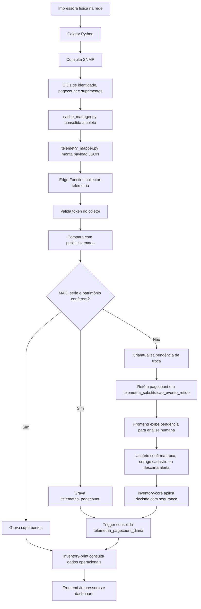
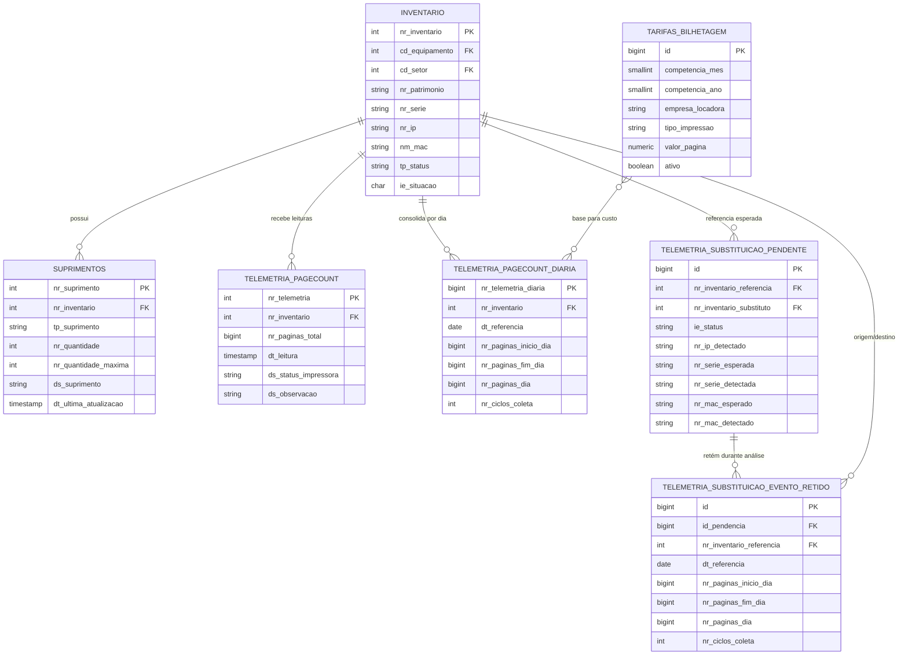
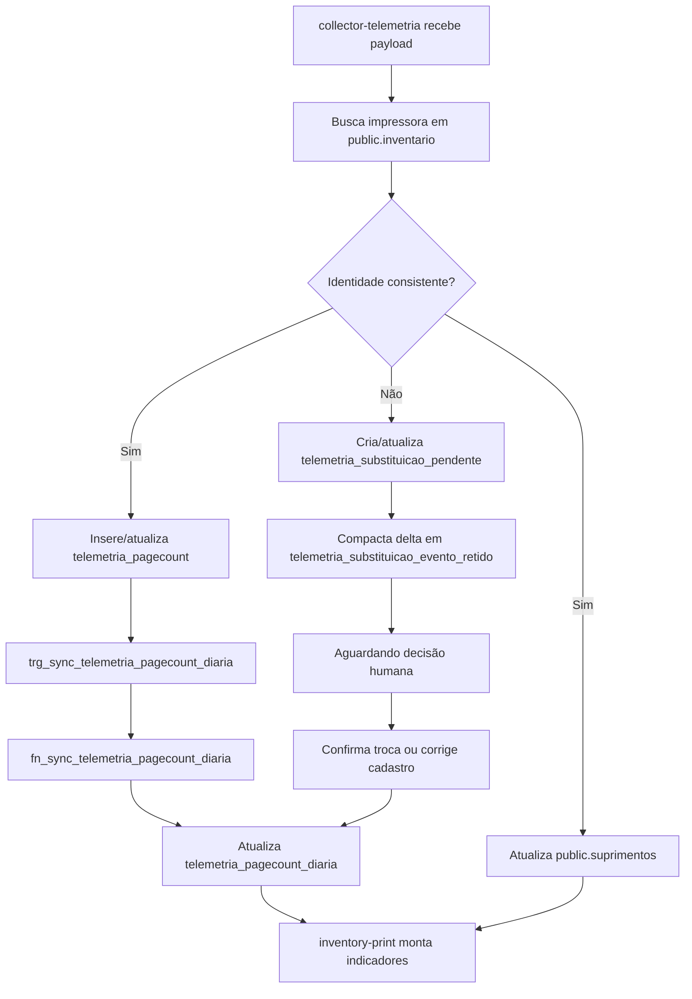
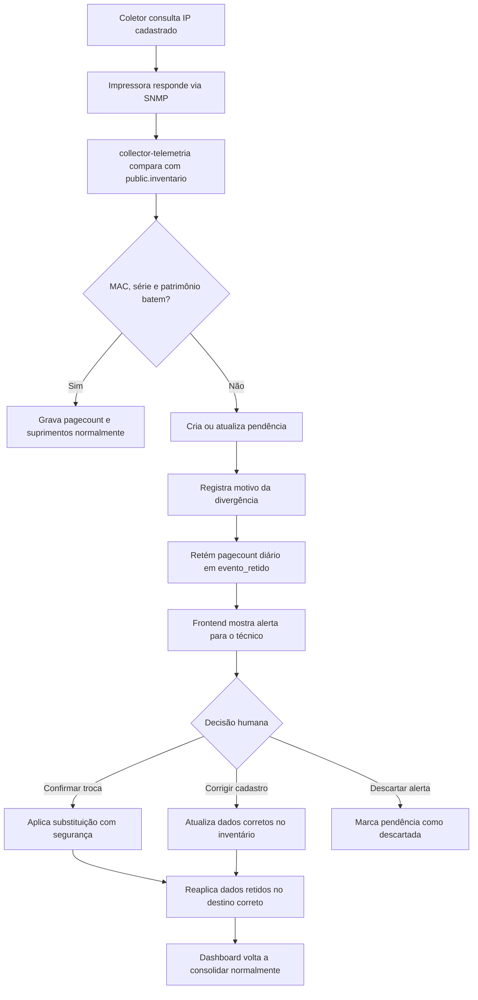

# Mapa de Estudo TCC - Impressoras e Telemetria

Este documento organiza a parte que deve ser apresentada no TCC: monitoramento de impressoras, coleta SNMP, telemetria, pagecount, suprimentos, troca assistida, dashboard e banco de dados relacionado a impressoras.

O inventário aparece aqui apenas como apoio, porque ele guarda o cadastro oficial das impressoras. O foco principal não é o inventário patrimonial completo, e sim o fluxo técnico que liga impressoras físicas na rede ao dashboard operacional.

## Introdução

A ideia central do módulo de impressoras é transformar informações que estão espalhadas nas impressoras físicas em dados confiáveis para operação.

Cada impressora possui um IP na rede e responde consultas SNMP. O coletor Python consulta essas impressoras, extrai informações como número de série, MAC, contador de páginas, status e níveis de suprimentos, monta um payload padronizado e envia para o backend no Supabase.

O sistema separa dois conceitos:

- Inventário: cadastro oficial do equipamento. Diz qual impressora deveria existir, em qual setor ela está, qual é o IP esperado, patrimônio, série, MAC e status operacional.
- Telemetria: dado coletado automaticamente da impressora real. Diz o que a impressora respondeu naquele momento pela rede.

Essa separação é importante porque o cadastro pode estar errado ou desatualizado, enquanto a telemetria mostra a realidade detectada. Quando os dois não batem, o sistema não altera tudo automaticamente: ele abre uma pendência para validação humana.

Objetivo simples para explicar:

> O sistema monitora impressoras de rede usando SNMP, grava pagecount e suprimentos no Supabase, evita distorções de contador em trocas físicas e exibe tudo em um dashboard operacional para a equipe de TI.

## Fluxo Geral do Sistema

O fluxo começa na impressora física e termina no painel web.

1. A impressora está ligada na rede e possui um IP.
2. O coletor Python busca no Supabase quais impressoras estão ativas e têm IP cadastrado.
3. Para cada IP, o coletor consulta a impressora usando SNMP.
4. O SNMP retorna dados técnicos como contador total, série, MAC, hostname, status e suprimentos.
5. O coletor transforma esses dados em um payload JSON padronizado.
6. O payload é enviado para a Edge Function `collector-telemetria`.
7. A Edge Function valida o token do coletor e compara os dados coletados com o cadastro oficial em `public.inventario`.
8. Se a identidade da impressora estiver correta, grava pagecount e suprimentos.
9. Se houver divergência de MAC, série ou patrimônio, cria uma pendência de troca assistida e retém o pagecount diário em uma tabela compactada.
10. O banco consolida o contador total em páginas do dia por trigger SQL.
11. A Edge Function `inventory-print` entrega os dados consolidados para o dashboard.
12. O frontend mostra indicadores, alertas, suprimentos, status operacional e volume de impressão.



## Coletor Python

O coletor Python é o serviço local que conversa com as impressoras. Ele roda fora do Supabase, dentro da rede onde as impressoras estão acessíveis.

### `run_collector_loop.py`

Arquivo responsável por manter o coletor rodando em ciclos.

O que faz:

- inicia o loop de coleta;
- chama `atualizar_cache()`;
- registra início e fim de cada ciclo;
- trata erros para o processo não morrer sem log;
- respeita intervalo entre coletas.

Como explicar:

> É o motor do coletor. Ele acorda de tempos em tempos, atualiza a lista de impressoras, coleta SNMP e envia os dados para o backend.

### `cache_manager.py`

Arquivo central da coleta.

O que faz:

- busca a lista de impressoras ativas;
- filtra IPs permitidos;
- usa workers para coletar várias impressoras em paralelo;
- chama o cliente SNMP;
- interpreta pagecount e suprimentos;
- monta dados intermediários;
- envia payload para a API.

Ponto importante:

- usa `ThreadPoolExecutor` para paralelismo;
- o número de workers é controlado por variável de ambiente, como `COLLECTOR_MAX_WORKERS`;
- isso evita que o coletor seja lento demais, mas também permite controlar carga para não sobrecarregar Supabase ou rede.

Como explicar:

> É o coordenador da coleta. Ele pega a lista oficial de impressoras, distribui a consulta entre workers, junta as respostas e prepara o envio.

### `snmp_client.py`

Arquivo responsável por executar consultas SNMP.

O que faz:

- usa a biblioteca `pysnmp`;
- executa consultas SNMP GET e WALK;
- lida com timeout, erro de comunidade SNMP e impressora offline;
- normaliza respostas para o restante do sistema.

Como explicar:

> É a peça que realmente conversa com a impressora. O resto do sistema não precisa saber os detalhes do protocolo SNMP; ele chama esse módulo e recebe os valores já tratados.

### `telemetry_mapper.py`

Arquivo que transforma dados brutos em payload.

O que faz:

- recebe informações coletadas;
- monta o objeto `impressora`;
- monta a lista de `suprimentos`;
- inclui `contador_total_paginas`;
- gera `ingestao_id`;
- devolve o JSON no formato aceito pela Edge Function `collector-telemetria`.

Como explicar:

> É o tradutor entre o mundo SNMP e o backend. Ele pega dados técnicos e organiza em um contrato JSON estável.

### `api_client.py`

Arquivo que conversa com Supabase e Edge Functions.

O que faz:

- lê configurações do `.env`;
- busca impressoras no Supabase;
- envia telemetria para a Edge Function;
- controla retries;
- grava pendências locais quando o envio falha;
- faz replay de payloads pendentes quando possível.

Como explicar:

> É o cliente HTTP do coletor. Ele sabe para onde enviar, qual token usar e como lidar com falhas temporárias.

### `runtime_trace.py`

Arquivo de rastreamento e diagnóstico.

O que faz:

- registra eventos relevantes do runtime;
- ajuda a entender falhas;
- cria trilha para auditoria técnica.

Como explicar:

> É como uma caixa-preta do coletor. Ajuda a explicar o que aconteceu quando uma coleta falha.

### `file_manager.py`

Arquivo de apoio para arquivos locais.

O que faz:

- lê e grava arquivos JSON/JSONL usados pelo coletor;
- controla cache local;
- guarda pendências de envio;
- evita perda total quando há falha temporária.

Como explicar:

> É o módulo que organiza os arquivos locais do coletor, como cache, logs e filas pendentes.

### Bibliotecas principais do coletor

`pysnmp`

- Biblioteca usada para falar SNMP com as impressoras.
- Permite consultar OIDs e receber valores de dispositivos de rede.
- No projeto, é usada para obter pagecount, série, MAC, status e suprimentos.

`requests` ou cliente HTTP equivalente

- Usado para chamadas HTTP para Supabase e Edge Functions.
- Envia payloads JSON.
- Recebe respostas de sucesso ou erro.

Bibliotecas padrão do Python

- `json`: ler e montar JSON.
- `datetime`: controlar data e hora da coleta.
- `logging`: registrar logs.
- `concurrent.futures`: executar coletas em paralelo com workers.
- `os`: ler variáveis de ambiente.
- `pathlib`: trabalhar com caminhos de arquivo.

## Explicação do SNMP

SNMP significa Simple Network Management Protocol. É um protocolo usado para consultar e monitorar equipamentos de rede.

No contexto do projeto, cada impressora funciona como um dispositivo gerenciado. O coletor funciona como gerente SNMP.

Funcionamento simples:

1. O coletor sabe o IP da impressora.
2. O coletor envia uma pergunta SNMP para esse IP.
3. A pergunta usa um OID.
4. A impressora responde com o valor daquele OID.
5. O coletor interpreta o valor.

OID significa Object Identifier. É como o endereço de uma informação dentro do equipamento.

Exemplo conceitual:

- um OID pode representar o contador total de páginas;
- outro OID pode representar o número de série;
- outro pode representar o nível de toner;
- outro pode representar o nome do suprimento.

Por que SNMP foi escolhido:

- é padrão em impressoras corporativas;
- não depende de acessar a tela web de cada impressora;
- permite coleta automática;
- permite monitorar muitos equipamentos;
- é adequado para dados operacionais como contador, status e suprimentos.

Como explicar para a banca:

> SNMP é o protocolo que permite perguntar para a impressora: "qual é seu contador?", "qual é seu número de série?", "qual é seu nível de toner?". O coletor faz essas perguntas automaticamente e transforma as respostas em dados para o dashboard.

## Payload de Telemetria

O payload é o JSON enviado pelo coletor para a Edge Function `collector-telemetria`.

Exemplo didático:

```jsonc
{
  "coletor_id": "coletor-hospital-ti",
  "coletado_em": "2026-05-22T11:30:00Z",
  "eventos": [
    {
      "ingestao_id": "evt-172-18-132-191-20260522113000",
      "coletado_em": "2026-05-22T11:30:00Z",
      "status": "online",
      "tempo_resposta_ms": 120,
      "contador_total_paginas": 521600,
      "impressora": {
        "ip": "172.18.132.191",
        "patrimonio": "293273",
        "numero_serie": "460031742FCF1",
        "endereco_mac": "788C774E3078",
        "hostname": "HGG-IUIMAT01",
        "modelo": "M3250",
        "fabricante": "Lexmark",
        "setor": "Ambulatório Oncologia - Sala Administrativa",
        "localizacao": "Ambulatório Oncologia - Sala Administrativa",
        "ativo": true
      },
      "suprimentos": [
        {
          "chave_suprimento": "cartucho_preto",
          "nome_suprimento": "Cartucho Preto",
          "nivel_percentual": 44,
          "status_suprimento": "ok",
          "raw_oid": "1.3.6.1...",
          "raw_value": "44"
        }
      ],
      "payload_bruto": {
        "source": "flask-snmp"
      }
    }
  ]
}
```

Explicação dos campos:

- `coletor_id`: identifica qual coletor enviou os dados.
- `coletado_em`: horário geral da coleta.
- `eventos`: lista de leituras. Normalmente cada evento representa uma impressora.
- `ingestao_id`: identificador único do evento para rastreio.
- `status`: estado da impressora no momento da coleta.
- `contador_total_paginas`: contador físico acumulado da impressora.
- `impressora.ip`: IP que respondeu.
- `impressora.patrimonio`: patrimônio detectado ou associado.
- `impressora.numero_serie`: número de série retornado pela impressora.
- `impressora.endereco_mac`: MAC detectado.
- `suprimentos`: lista de toners, kits, unidades de imagem e demais consumíveis.
- `payload_bruto`: área de diagnóstico para preservar dados técnicos da coleta.

## Edge Functions

As Edge Functions são APIs backend serverless no Supabase. Elas recebem requisições do frontend ou do coletor, validam dados e aplicam regras antes de gravar no banco.

### `collector-impressoras`

Função usada pelo coletor para descobrir quais impressoras deve coletar.

O que faz:

- valida o token do coletor;
- consulta `public.inventario`;
- busca itens ativos;
- retorna apenas impressoras com IP cadastrado;
- entrega ao coletor os dados necessários para SNMP.

Como explicar:

> Antes de sair consultando a rede, o coletor pergunta ao backend quais impressoras estão oficialmente ativas. Assim, ele não varre a rede inteira de forma cega.

### `collector-telemetria`

Função que recebe o payload SNMP do coletor.

O que faz:

- valida o token do coletor;
- normaliza o payload;
- identifica a impressora pelo IP e cadastro oficial;
- compara MAC, série e patrimônio;
- grava pagecount quando a identidade está consistente;
- grava suprimentos;
- cria pendência quando detecta divergência;
- retém pagecount diário quando a troca ainda não foi confirmada.

Como explicar:

> É a porta de entrada da telemetria. Ela decide se a coleta pode ser gravada normalmente ou se precisa ficar em análise por possível troca de impressora.

### `inventory-print`

Função usada pelo frontend para montar a visão operacional de impressoras.

O que faz:

- consulta impressoras no inventário;
- busca última telemetria;
- busca suprimentos;
- busca consolidação diária;
- calcula indicadores;
- retorna dados prontos para a tela `/impressoras` e para o dashboard.

Como explicar:

> É a API de leitura operacional. Ela junta cadastro, pagecount e suprimentos para o frontend não precisar montar regra complexa no navegador.

### Validação e segurança

O coletor não envia dados anonimamente. Ele usa token configurado no `.env`, e as Edge Functions validam esse token antes de aceitar requisições.

Além disso, regras críticas ficam no backend:

- comparação de identidade;
- gravação de telemetria;
- retenção de eventos;
- confirmação de troca;
- consolidação de pagecount.

Isso evita que o frontend grave dados críticos diretamente sem validação.

## Banco de Dados (Foco Principal)

O banco de dados usa PostgreSQL no Supabase. Abaixo estão apenas as tabelas importantes para impressoras e telemetria.



### `public.inventario`

Para que serve:

- É a fonte oficial das impressoras cadastradas.
- Guarda o que o sistema espera encontrar na rede.

Campos principais:

- `nr_inventario`: identificador interno.
- `cd_equipamento`: tipo/modelo de equipamento.
- `cd_setor`: setor onde o item está.
- `nr_patrimonio`: patrimônio físico.
- `nr_serie`: número de série cadastrado.
- `nr_ip`: IP esperado da impressora.
- `nm_mac`: MAC cadastrado, quando disponível.
- `tp_status`: status operacional, como ativo, backup ou manutenção.
- `ie_situacao`: situação lógica do item.

Relação com outras tabelas:

- relaciona com `suprimentos`;
- relaciona com `telemetria_pagecount`;
- relaciona com `telemetria_pagecount_diaria`;
- relaciona com pendências de substituição.

Papel no fluxo:

- O coletor usa essa tabela para saber quais impressoras coletar.
- A telemetria usa essa tabela para comparar se a impressora detectada é a mesma que estava cadastrada.

Como explicar para a banca:

> O inventário é a lista oficial. Ele diz: neste IP deveria estar esta impressora, com este patrimônio, esta série e este MAC.

### `public.suprimentos`

Para que serve:

- Guarda o estado atual dos suprimentos das impressoras.
- Exemplos: cartucho preto, unidade de imagem, kit de manutenção, toner colorido.

Campos principais:

- `nr_suprimento`: identificador do suprimento.
- `nr_inventario`: impressora relacionada.
- `tp_suprimento`: tipo técnico.
- `nr_quantidade`: nível atual.
- `nr_quantidade_maxima`: capacidade máxima quando disponível.
- `ds_suprimento`: nome amigável.
- `dt_ultima_atualizacao`: última atualização.

Relação com outras tabelas:

- Cada suprimento pertence a uma impressora em `public.inventario`.

Papel no fluxo:

- A Edge `collector-telemetria` atualiza essa tabela com os níveis coletados via SNMP.
- A Edge `inventory-print` usa esses dados para mostrar alertas de suprimento crítico ou baixo.

Como explicar para a banca:

> Essa tabela é o painel de saúde dos consumíveis. Ela mostra quais impressoras estão com toner, unidade de imagem ou kit de manutenção em nível crítico.

### `public.telemetria_pagecount`

Para que serve:

- Guarda leituras de contador total de páginas.
- Representa o contador físico acumulado da impressora no momento da coleta.

Campos principais:

- `nr_telemetria`: identificador da leitura.
- `nr_inventario`: impressora relacionada.
- `nr_paginas_total`: contador acumulado da impressora.
- `dt_leitura`: data/hora da leitura.
- `ds_status_impressora`: status da impressora.
- `ds_observacao`: observações técnicas.

Relação com outras tabelas:

- pertence a uma impressora em `public.inventario`;
- alimenta `telemetria_pagecount_diaria` por trigger.

Papel no fluxo:

- Recebe a leitura aceita da telemetria.
- Serve como base para calcular variação diária.

Como explicar para a banca:

> Essa tabela guarda o que a impressora disse que já imprimiu no total da vida dela. Ela não é, por si só, a quantidade impressa no dia.

### `public.telemetria_pagecount_diaria`

Para que serve:

- Guarda a produção diária calculada a partir dos contadores totais.
- Evita precisar recalcular tudo a cada carregamento de dashboard.

Campos principais:

- `nr_inventario`: impressora.
- `dt_referencia`: dia da consolidação.
- `nr_paginas_inicio_dia`: primeiro contador confiável do dia.
- `nr_paginas_fim_dia`: último contador confiável do dia.
- `nr_paginas_dia`: páginas efetivamente atribuídas ao dia.
- `nr_ciclos_coleta`: quantas coletas atualizaram o dia.
- `dt_primeira_leitura`: primeira leitura do dia.
- `dt_ultima_leitura`: última leitura do dia.

Relação com outras tabelas:

- pertence a `public.inventario`;
- é alimentada a partir de `telemetria_pagecount`;
- é usada pelo dashboard e cálculo de custo.

Papel no fluxo:

- Transforma contador acumulado em produção diária.
- Protege o dashboard contra leituras fora de ordem, quedas e saltos suspeitos.

Como explicar para a banca:

> A impressora informa um total acumulado. Essa tabela calcula o que interessa para gestão: quantas páginas foram feitas em cada dia.

### `public.telemetria_substituicao_pendente`

Para que serve:

- Guarda alertas de possível troca física ou erro cadastral.

Campos principais:

- `id`: identificador da pendência.
- `ie_status`: pendente, confirmado ou descartado.
- `nr_inventario_referencia`: item que deveria estar naquele IP.
- `nr_inventario_substituto`: item confirmado como substituto, quando resolvido.
- `nr_ip_detectado`: IP onde houve divergência.
- `nr_patrimonio_esperado` e `nr_patrimonio_detectado`.
- `nr_serie_esperada` e `nr_serie_detectada`.
- `nr_mac_esperado` e `nr_mac_detectado`.
- `ds_motivo`: motivo do alerta.
- `payload_evento`: payload usado como evidência.

Relação com outras tabelas:

- referencia `public.inventario`;
- possui eventos retidos em `telemetria_substituicao_evento_retido`.

Papel no fluxo:

- Evita substituição totalmente automática.
- Coloca o humano no controle quando há divergência.

Como explicar para a banca:

> Se o sistema percebe que o IP respondeu com outra série ou outro MAC, ele não muda tudo sozinho. Ele abre uma pendência para o técnico validar.

### `public.telemetria_substituicao_evento_retido`

Para que serve:

- Guarda produção diária em quarentena enquanto uma pendência não foi resolvida.
- Evita perder pagecount durante a análise.
- Evita criar uma linha por ciclo de coleta.

Campos principais:

- `id_pendencia`: pendência relacionada.
- `nr_inventario_referencia`: inventário originalmente esperado.
- `dt_referencia`: dia da retenção.
- `nr_paginas_inicio_dia`: contador base da retenção.
- `nr_paginas_fim_dia`: último contador retido do dia.
- `nr_paginas_dia`: delta diário retido.
- `nr_ciclos_coleta`: quantidade de ciclos compactados.
- `payload_ultimo_evento`: último payload usado como evidência.
- `dt_replay`: quando o dado foi reaplicado.
- `nr_inventario_destino`: destino final após confirmação/correção.

Relação com outras tabelas:

- pertence a uma pendência em `telemetria_substituicao_pendente`;
- referencia inventário.

Papel no fluxo:

- Segura a produção até o técnico decidir.
- Quando a troca é confirmada ou o cadastro é corrigido, o sistema pode aplicar o resumo diário no destino correto.

Como explicar para a banca:

> É uma quarentena inteligente. O sistema não joga fora as páginas coletadas durante a dúvida, mas também não mistura com a impressora errada.

### `public.tarifas_bilhetagem`

Para que serve:

- Guarda valores por página para cálculo financeiro.

Campos principais:

- `competencia_mes` e `competencia_ano`: período da tarifa.
- `empresa_locadora`: empresa responsável.
- `tipo_impressao`: preto e branco ou colorida.
- `valor_pagina`: custo por página.
- `ativo`: indica se a tarifa está em uso.

Relação com outras tabelas:

- é usada junto com pagecount diário para estimar custo.

Papel no fluxo:

- Permite transformar volume de impressão em valor financeiro estimado.

Como explicar para a banca:

> Depois que o sistema sabe quantas páginas foram impressas, essa tabela permite estimar o custo usando a tarifa da locadora.

## Fluxo de Telemetria Dentro do Banco



## Trigger e Consolidação Diária

### `trg_sync_telemetria_pagecount_diaria`

É o trigger que roda automaticamente depois de inserir ou atualizar uma leitura em `telemetria_pagecount`.

Ele chama a função `fn_sync_telemetria_pagecount_diaria`.

### `fn_sync_telemetria_pagecount_diaria`

É a função SQL que transforma contador total em páginas do dia.

Diferença essencial:

- Contador total: número acumulado dentro da impressora desde sua vida útil.
- Páginas do dia: diferença segura entre leituras do mesmo dia.

Exemplo:

- Primeira leitura do dia: 10.000 páginas.
- Segunda leitura do dia: 10.050 páginas.
- Produção do dia: 50 páginas.

O sistema não soma 10.000 + 10.050. Ele calcula o delta: 50.

Proteções aplicadas:

- Se a leitura vier fora de ordem, não altera o acumulado diário.
- Se o contador cair muito, não subtrai páginas.
- Se o contador subir de forma absurda, trata como salto suspeito e não soma o histórico inteiro.

Como explicar para a banca:

> A trigger é o mecanismo automático que mantém o resumo diário atualizado. Ela pega leituras acumuladas e transforma em produção real do dia, com regras de segurança.

## Proteção Contra Explosão de Pagecount

O problema:

Uma impressora backup pode estar guardada com 500.000 páginas no contador físico. Se ela substituir uma impressora que tinha apenas 20 páginas impressas no dia, o sistema não pode interpretar que o setor imprimiu 500.000 páginas naquele dia.

Solução aplicada:

- O sistema trabalha com delta entre leituras confiáveis.
- Saltos muito grandes são tratados como suspeitos.
- Divergência de identidade bloqueia gravação normal.
- Durante pendência, os dados ficam retidos por dia.
- A confirmação manual decide onde aplicar a produção.

Exemplo simples:

- Impressora antiga no setor imprimiu 20 páginas.
- Impressora backup entra no lugar com contador físico 500.000.
- O sistema detecta mudança de identidade.
- Não soma 500.000 no dia.
- A partir da confirmação, novas páginas passam a ser associadas corretamente.

Como explicar:

> O sistema não considera o contador físico inteiro como produção do dia. Ele usa variação segura e pendência de troca para impedir distorção.

## Troca Assistida

A troca assistida existe para lidar com situações reais:

- impressora queimada;
- impressora backup colocada no lugar;
- IP reaproveitado;
- cadastro com MAC ou série errado;
- troca física feita antes da atualização do inventário.

O sistema compara:

- IP;
- patrimônio;
- número de série;
- MAC address.

Se detectar divergência, cria uma pendência.



Como explicar:

> A troca assistida é uma validação semi-automática. O sistema detecta a suspeita sozinho, mas a decisão final é humana para evitar alterações erradas.

## Dashboard e Frontend

### `/impressoras`

Tela operacional das impressoras.

Mostra:

- total de impressoras;
- impressoras online;
- impressoras offline;
- impressoras com toner baixo;
- impressoras com toner crítico;
- filtros por status e suprimento;
- última coleta;
- total de páginas;
- menor suprimento;
- suprimentos agrupados.

### `inventory-print`

Edge Function que alimenta a tela.

Ela junta:

- cadastro oficial em `public.inventario`;
- última leitura em `telemetria_pagecount`;
- consolidação diária em `telemetria_pagecount_diaria`;
- suprimentos em `public.suprimentos`;
- tarifas em `public.tarifas_bilhetagem`.

### `PainelDashboard.tsx`

Componente do painel principal.

Mostra:

- volume de impressão;
- custos estimados;
- alertas;
- indicadores agregados.

Como explicar:

> O frontend não é só uma tabela. Ele é a camada de visualização que transforma telemetria técnica em indicadores operacionais.

## Perguntas Prováveis da Banca

### 1. O que é SNMP?

SNMP é um protocolo de gerenciamento de dispositivos de rede. No projeto, ele é usado para consultar impressoras e obter contador de páginas, número de série, MAC, status e suprimentos.

### 2. O que é OID?

OID é o identificador de uma informação dentro do dispositivo. Cada dado da impressora, como contador ou nível de toner, pode ser consultado por um OID.

### 3. Por que usar Python no coletor?

Porque o coletor precisa rodar dentro da rede local, acessar IPs internos e usar bibliotecas maduras para SNMP. Python facilita automação, logs, paralelismo e integração HTTP.

### 4. Como o coletor sabe quais impressoras consultar?

Ele chama a Edge Function `collector-impressoras`, que consulta `public.inventario` e retorna impressoras ativas com IP cadastrado.

### 5. O frontend grava dados críticos diretamente no banco?

Não. Regras críticas passam por Edge Functions. O frontend chama APIs, e o backend valida permissão, payload e regra de negócio antes de gravar.

### 6. Qual a diferença entre contador total e páginas do dia?

Contador total é o número acumulado da impressora. Páginas do dia é a diferença calculada entre leituras confiáveis no mesmo dia.

### 7. Como o sistema evita explosão de pagecount?

Ele calcula delta, ignora saltos suspeitos e usa troca assistida quando detecta divergência de identidade.

### 8. O que acontece quando uma impressora é trocada?

O sistema compara MAC, série e patrimônio. Se houver divergência, cria pendência e retém o pagecount até confirmação ou correção.

### 9. O sistema perde impressões enquanto a pendência não é resolvida?

Não necessariamente. Ele mantém um resumo diário retido em `telemetria_substituicao_evento_retido`, evitando flood de linhas e permitindo reaplicar os dados depois.

### 10. Por que não confirmar troca automaticamente?

Porque uma divergência pode ser troca real ou erro cadastral. A decisão humana evita mover ou alterar impressoras erradas.

### 11. O que acontece se a impressora estiver offline?

O coletor registra status offline ou falha de resposta SNMP. O dashboard pode mostrar ausência de leitura ou status operacional conforme os dados recebidos.

### 12. Como os suprimentos são monitorados?

O coletor consulta OIDs de suprimento via SNMP, envia os níveis para `collector-telemetria`, e a tabela `suprimentos` é atualizada para o dashboard exibir alertas.

### 13. Qual é o papel do Supabase?

O Supabase fornece PostgreSQL, Edge Functions e autenticação. No projeto, ele funciona como backend e banco de dados central.

### 14. O que torna o projeto útil para a operação?

Ele reduz conferência manual, detecta troca física, monitora suprimentos críticos e transforma dados técnicos em indicadores claros.

## Ordem Para Estudar

1. Entender o problema operacional: impressoras, setores, pagecount e suprimentos.
2. Estudar a diferença entre inventário e telemetria.
3. Estudar SNMP e OID.
4. Ler o fluxo do coletor Python.
5. Entender o payload JSON enviado pelo coletor.
6. Estudar `collector-impressoras`.
7. Estudar `collector-telemetria`.
8. Estudar as tabelas `telemetria_pagecount` e `telemetria_pagecount_diaria`.
9. Estudar a trigger de consolidação diária.
10. Estudar troca assistida e eventos retidos.
11. Estudar `inventory-print`.
12. Estudar o dashboard `/impressoras`.
13. Treinar a fala de apresentação usando os fluxogramas.

## Fala Pronta Para Apresentação

> A parte principal do meu projeto é o monitoramento operacional de impressoras. O sistema parte de uma necessidade real: acompanhar impressoras distribuídas em vários setores, saber se estão online, quanto imprimem, quais suprimentos estão críticos e quando uma impressora foi trocada fisicamente.
>
> Para isso, eu utilizei um coletor em Python rodando dentro da rede. Esse coletor consulta as impressoras por SNMP, que é um protocolo próprio para gerenciamento de dispositivos de rede. Através de OIDs, ele consegue obter informações como número de série, MAC, contador total de páginas e níveis de suprimentos.
>
> Depois da coleta, o Python monta um payload JSON e envia para uma Edge Function no Supabase chamada `collector-telemetria`. Essa função valida o token do coletor, compara os dados coletados com o cadastro oficial da impressora no inventário e decide se a leitura pode ser gravada normalmente.
>
> Quando a identidade bate, o sistema grava o contador em `telemetria_pagecount` e os suprimentos em `suprimentos`. Em seguida, uma trigger SQL atualiza a tabela `telemetria_pagecount_diaria`, que transforma o contador total acumulado da impressora em páginas realmente impressas no dia.
>
> Um ponto importante é a proteção contra distorção de contador. Impressoras têm contador físico histórico. Se uma impressora backup com 500 mil páginas for colocada no lugar de outra, o sistema não pode dizer que o setor imprimiu 500 mil páginas naquele dia. Por isso, o cálculo usa delta, bloqueia saltos suspeitos e, se detectar divergência de MAC, série ou patrimônio, cria uma pendência de troca assistida.
>
> Nessa troca assistida, o sistema não altera tudo automaticamente. Ele registra a pendência, retém os dados de pagecount em uma tabela diária compactada e mostra o alerta no frontend. O técnico pode confirmar a troca, corrigir o cadastro ou descartar o alerta.
>
> Por fim, a Edge Function `inventory-print` consolida esses dados para o dashboard de impressoras, exibindo indicadores como volume de impressão, suprimentos críticos, status online e métricas operacionais. Assim, o projeto conecta hardware real, coleta SNMP, backend serverless, banco PostgreSQL e frontend em uma solução prática para gestão de impressoras.

## Frase Final Forte

> O principal valor do sistema é transformar dados técnicos coletados automaticamente das impressoras em informação confiável para decisão operacional, com segurança contra erros de cadastro, trocas físicas e distorções de pagecount.
